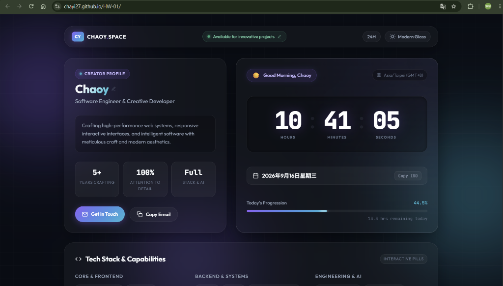

# HW-01 — Personal Web Space & Live Temporal Dashboard

A sleek personal space featuring real-time clock synchronization, time-of-day greetings, fluid glassmorphism aesthetics, and responsive layout.

🔗 **Live Demo**: [https://chayi27.github.io/HW-01/](https://chayi27.github.io/HW-01/)



## ✨ Features

- ⏱️ **Real-Time Clock Dashboard**: Live hours, minutes, and seconds with tabular numbers.
- ☀️ **Dynamic Day Greeting**: Automatically adapts based on the hour (Morning, Afternoon, Evening, Late Night Flow).
- 📅 **Localized Calendar & Timezone**: Local date formatting and UTC/GMT offset auto-detection.
- 📊 **Day Progression Tracker**: Dynamic percentage and remaining hours counter for the current day.
- 🎨 **Theme System**: Seamless toggle between *Modern Glass*, *Cyber Neon*, and *Sunset Amber*.
- 🔄 **12H / 24H Mode Toggle**: Switch between military and AM/PM time with one click.
- ✏️ **Inline Autosave**: Directly edit name, title, bio, and status on-screen with automatic `localStorage` persistence.
- 📱 **Fully Responsive**: Mobile, tablet, and desktop optimized.

## 🚀 Getting Started

Simply open `index.html` in any web browser, or serve it using Python:

```bash
python -m http.server 8080
```

Then visit [http://localhost:8080](http://localhost:8080).

## 🛠️ Built With

- Semantic **HTML5**
- Vanilla **CSS3** (Glassmorphism, custom CSS properties, keyframe animations)
- Vanilla **JavaScript** (Zero dependencies)